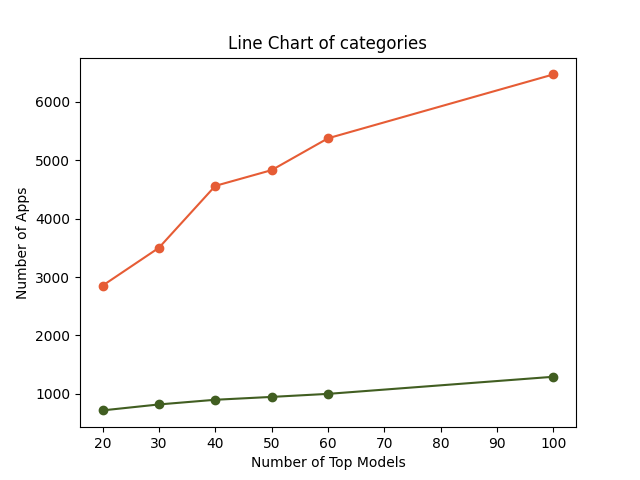
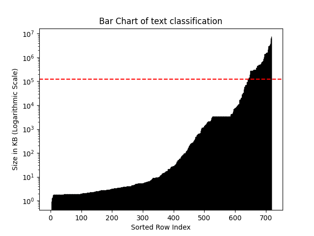
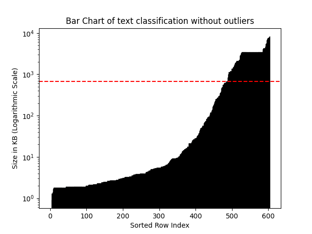
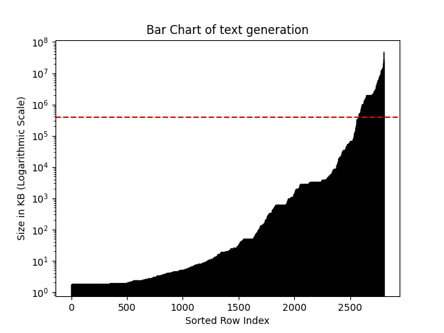
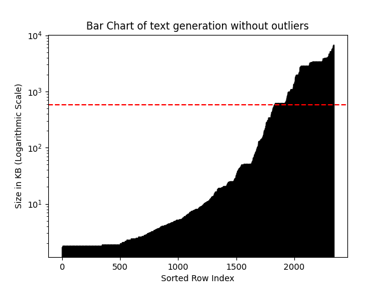

# HuggingFace Analyser

Writer: Amir Mohammad Karimi

Date: Jan 19, 2024

## Results

The analysis between Text Generation and Text Classification application development and maintenance.

Based on the result of the comparison made by the crawler, the results are:

1. The number of apps based on text generation is significantly higher than that for text classification - 2804 compared
to 719, respectively - among the top 20 most-downloaded models. Refer to Figure 1 for the relationship between
   number of top models and the number of applications.

*Figure 1: Number of top models to unique apps*

| Number of top models | Number of unique text classification apps | Number of unique text generation apps |
|----------------------|-------------------------------------------|---------------------------------------|
| 20                   | 717                                       | 2853                                  |
| 30                   | 819                                       | 3501                                  |
| 40                   | 899                                       | 4561                                  |
| 50                   | 948                                       | 4831                                  |
| 60                   | 1000                                      | 5376                                  |
| 100                  | 1293                                      | 6470                                  |
*Table 1: Number of top models, text classification apps, and text generation apps*

As you can see, the number of text generation apps are significantly larger than the number of text
classification apps.

2. Although, the average size of text generation and text classification apps does not have a huge difference
after removing the outliers, the size of text classification apps is slightly larger. The method for removing outliers
here is `Interquartile Range`, which can be more useful when
dealing with many extreme outliers. `Standard Deviation` is also implemented in [drawer.py](drawer.py).

| Category            | Mean     | Standard deviation | Mean after preprocess | Standard deviation after preprocess |
|---------------------|----------|--------------------|-----------------------|-------------------------------------|
| Text Generation     | 382675.0 | 2214551.1          | 583.2                 | 1260.9                              |
| Text Classification | 121570.5 | 572258.1           | 667.1                 | 1453.6                              |
*Table 2: Mean and Standard deviation of apps' size before and after preprocess for the two categories in KB*

*Figure 2: Bar chart of text classification apps' size*

*Figure 3: Bar chart of text classification apps' size after preprocess*

*Figure 4: Bar chart of text generation apps' size*

*Figure 5: Bar chart of text generation apps' size after preprocess*

**Although the underlying use cases are unclear and evidence for conclusion is limited, it seems that text generation
apps require less development and maintenance efforts than text classification apps.**

## Other factors

There are many other factors that can be considered to scrutinize:

**1. Code Churn and Commits Analysis**

Code Churn: Assessing the frequency of changes and the size of each change provides insights into the dynamic nature
of the codebase. Higher churn may indicate ongoing development or maintenance efforts.

Last Commit Date: Knowing when the last commit occurred helps understand the project's recent activity.

Number of Changes in Each Commit: Analyzing the granularity of changes helps identify the scope of modifications in
each commit.

**2. Number of Contributors:**
A higher number of contributors may suggest a more collaborative development process but could also indicate complexity.
Understanding the contributors' roles and contributions can provide additional context.

**3. White-box analysis of apps:**
The higher the number of APIs (Restful, gRPC, etc.), the more use-cases there are. Therefore, harder to maintain.
Other aspects of white-box analysis can be the number of tests, number of exceptions, number of files,
number of functions and methods, depth of inheritance, etc. Plus, considering the number of models used in one app and
the app/model ratio gives insight into application complexity.

**4. The Number of Downloads and Likes:**

Downloads: Higher download numbers may indicate popularity and real-world usage. However, it's essential to consider the
target audience and whether the app meets user expectations.

Likes: Positive feedback in terms of likes can indicate user satisfaction and the perceived value of the app.

**5. Use-cases Comparison:**
Without comparing the complexity of each categories' apps use cases, the comparison of development and maintenance
efforts are more like comparing an apple and orange, without context.

**6. Identifying Trends:**
Observing trends in downloads and likes over time can provide insights into the evolving interest
and demand for applications in each category. The more in demand, the more complex use cases can be.

**7. Community Engagement:**
Active community involvement can indicate ongoing support and collaboration, and probably more complex use cases.
Each task communities such as forums, mailing services, discussion boards, or other channels can be the sources of this
evaluation.

## Conclusion

Considering the factors mentioned above, a comprehensive analysis becomes possible.  It's important to acknowledge 
potential validity threats, including the limited dataset sizes from each category, the absence of a downloads/likes 
ratio for assessing an app's value, and HuggingFace's resource limitations for serving complex applications or gated
models. Additionally, a subtle (< 10%) discrepancy in the number of applications per model may occur due to the dynamic
nature of HuggingFace's platform, involving the creation or removal of applications over time.